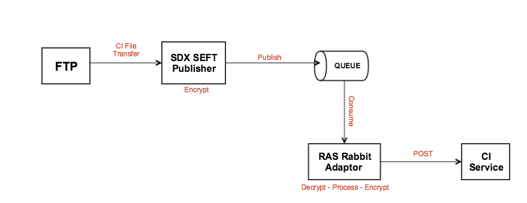

# SDC-CI-Upload-Compose
Docker compose for services that allow uploading a SEFT CI to **Collection Instrument** service

# Overview
Here is a flow diagram to demonstrate how a SEFT CI gets uploaded to the CI service from an FTP server:



### Start both services:

**Please note**
To use compose, you will need to run CI service through the docker-dev compose
```
docker-compose up
```

### Stop running services:
```
docker-compose down
```

### Generating keys
 
Test keys have been generated and stored in the `test_keys` folder, they were generated using:
```
openssl genrsa -out sdc-ras-seftupload-encryption-private-v1.pem 4096
openssl rsa -pubout -in sdc-ras-seftupload-encryption-private-v1.pem -out sdc-ras-seftupload-encryption-public-v1.pem

openssl genrsa -out sdc-sdx-seftupload-signing-private-v1.pem 4096
openssl rsa -pubout -in sdc-sdx-seftupload-signing-private-v1.pem -out sdc-sdx-seftupload-signing-public-v1.pem
```

### Use a specific tag for a service:

If, for example, a specific branch from a PR is required for testing purposes,
the `docker-compose.yml` file can be modified locally by appending a tag to an image name:

```
image: sdcplatform/ras-rabbit-adaptor-service:<branch-name>
```