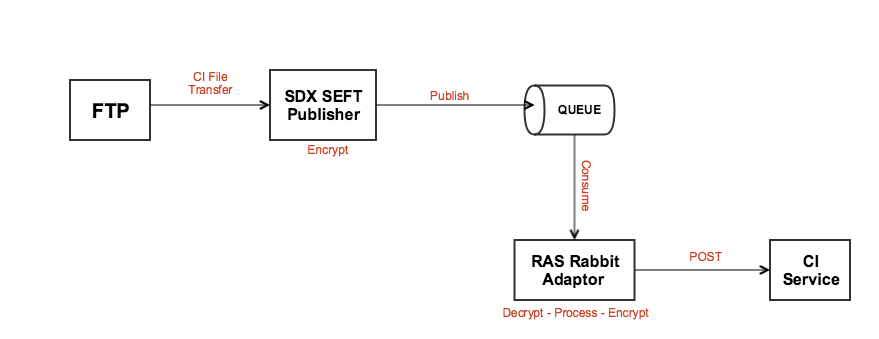

# SDC-CI-Upload-Compose
Docker compose for services that allow uploading a SEFT CI to **Collection Instrument** service

# Overview
Here is a flow diagram to demonstrate how a SEFT CI gets uploaded to the CI service from an FTP server:



### Start both services:

**Please note**
To truly use compose, you will need to have an FTP server running on your machine and also run CI service through the 
docker-dev compose
```
docker-compose up
```

### Stop running services:
```
docker-compose down
```

### Use a specific tag for a service:

If, for example, a specific branch from a PR is required for testing purposes,
the `docker-compose.yml` file can be modified locally by appending a tag to an image name:
```
image: sdcplatform/ras-rabbit-adaptor-service:<branch-name>
```