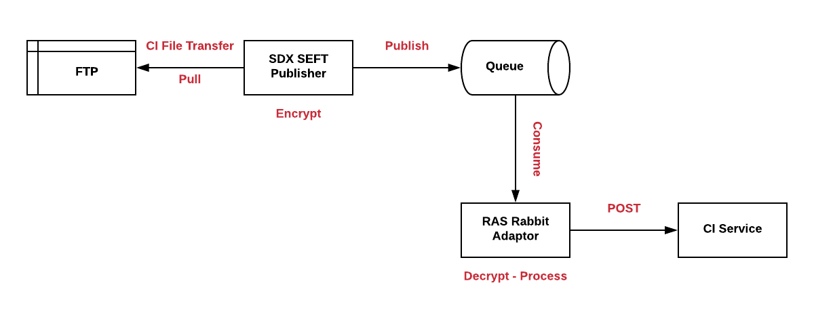

# SDC-CI-Upload-Compose
Docker compose for services that allow uploading a SEFT CI to **Collection Instrument** service

# Overview
Here is a flow diagram to demonstrate how a SEFT CI gets uploaded to the CI service from an FTP server:



### Start both services:

**Please note**
To use compose, you will need to run CI service through the docker-dev compose
```
docker-compose up
```

### Stop running services:
```
docker-compose down
```

### How to run

When running the docker-compose, you may encounter problems with keys that it uses in `ras-rabbit-adaptor.
You may have to create a new set of keys and replace the current ones to get it to work.

```
openssl genrsa -out sdc-sdx-inbound-encryption-private-v1.pem 4096
openssl rsa -pubout -in sdc-sdx-inbound-encryption-private-v1.pem -out sdc-sdx-inbound-encryption-public-v1.pem
openssl genrsa -out sdc-ras-authentication-signing-private-v1.pem 4096
openssl rsa -pubout -in sdc-ras-authentication-signing-private-v1.pem -out sdc-ras-authentication-signing-public-v1.pem
```
These commands will help you generate new keys which you'll have to incorporate into the `CI_SECRETS`
environment variable in `docker-compose.yml`

If that doesn't work you may have to edit the code in `ras-rabbit-adaptor` to turn off the decrypter
that it uses.

### Use a specific tag for a service:

If, for example, a specific branch from a PR is required for testing purposes,
the `docker-compose.yml` file can be modified locally by appending a tag to an image name:

```
image: sdcplatform/ras-rabbit-adaptor-service:<branch-name>
```